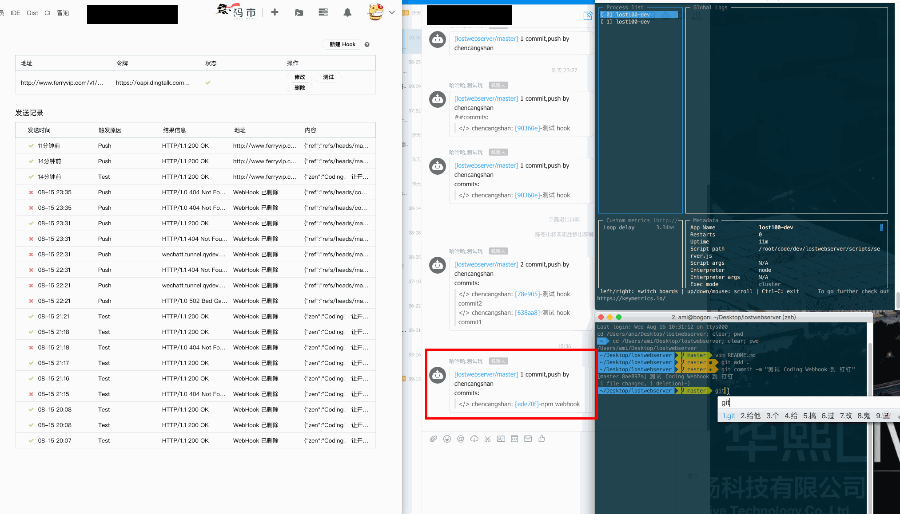
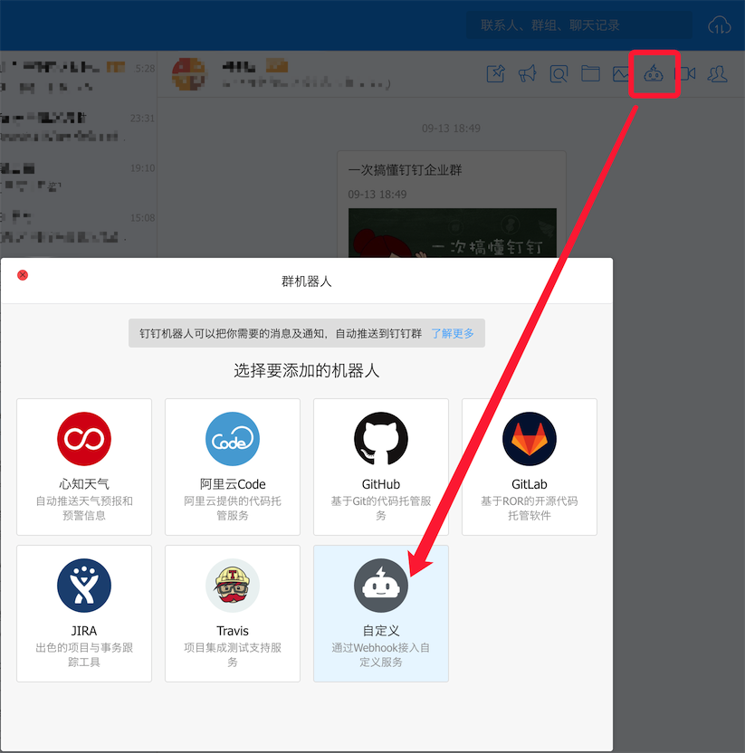
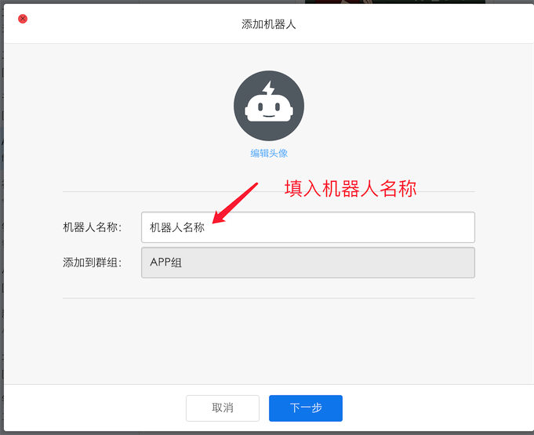
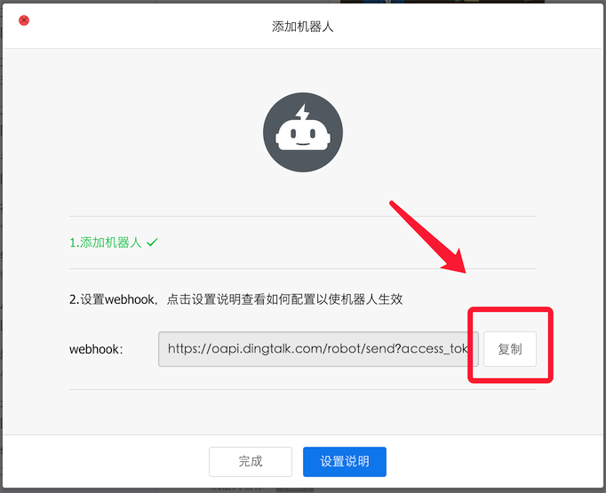
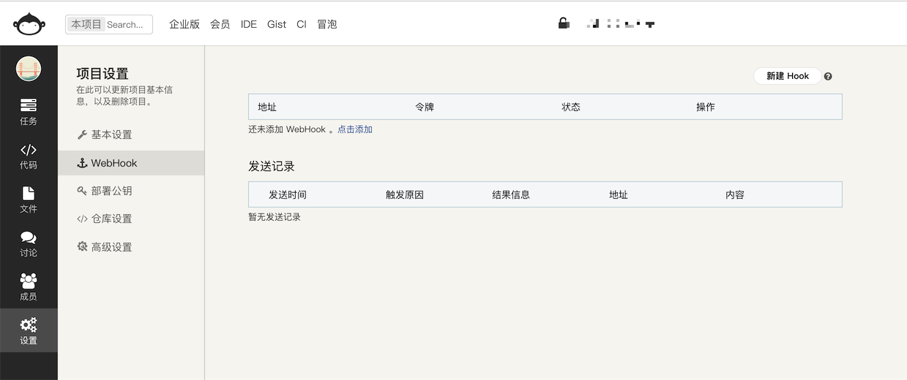
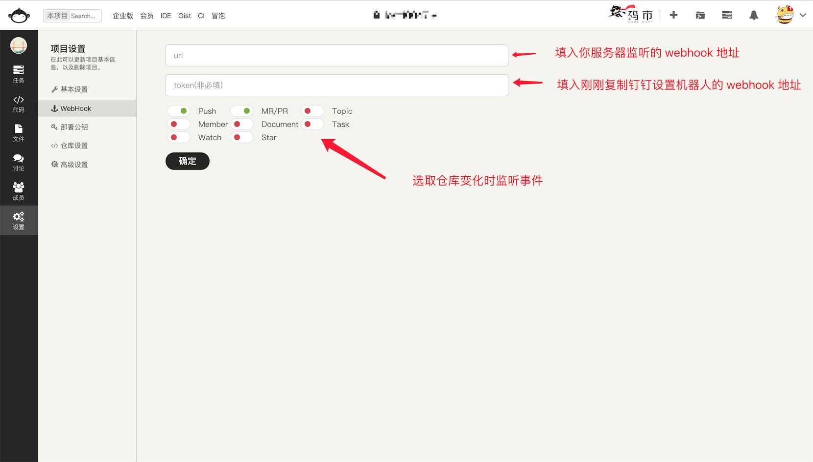

# CWD - Coding Webhook DingDing

> 


用于实现 Coding 上面仓库变化后,把消息发送到钉钉上;利用钉钉的机器人和 Coding 的 Webhook 相互配合实现,需要有服务器;

## 安装

`npm i --save hookding`

## 使用方法


```js
    const CWD = require('hookding');

    app.post('/router', CWD());

```

### 1. 首先钉钉群里设置自定义机器人

**设置自定义机器人**

> 

**填入机器人名称**
> 

**复制 webhook 地址,后面有用**
> 

### 2. Coding 仓库 Webhook 设置
**点击到要设置的仓库 Webhook 页面,点击新建 Webhook**
> 

**url 填入服务器上要监听的地址, token 填入刚才钉钉复制的 Webhook 地址,以及选取底部的监听类型,至少要勾选 Push**
> 

**如果配置顺利,在你以后每次仓库的变化,在钉钉上面都会收到消息提醒**
> 

